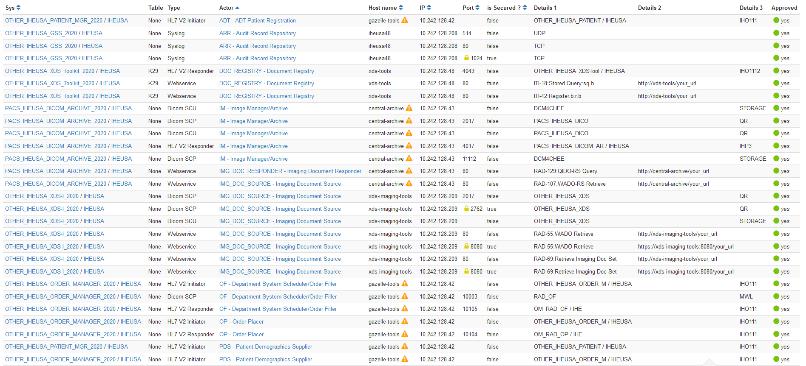
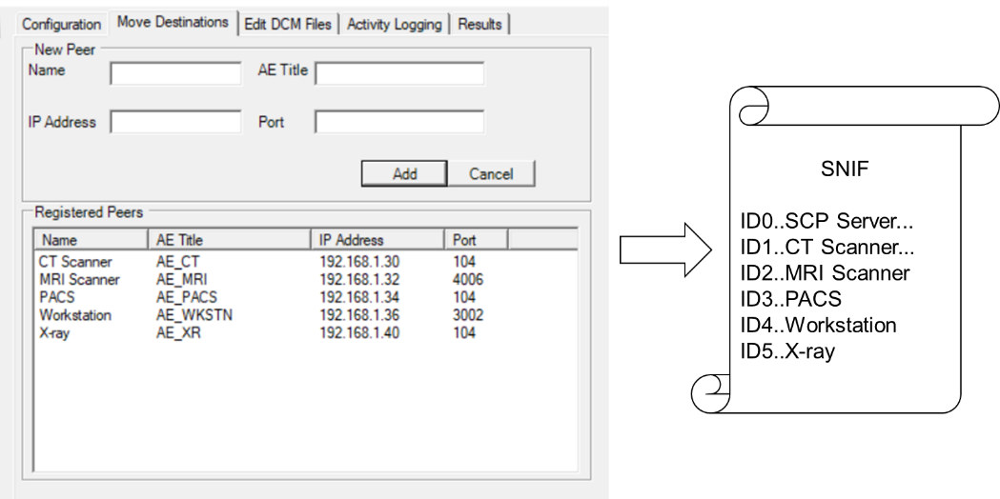
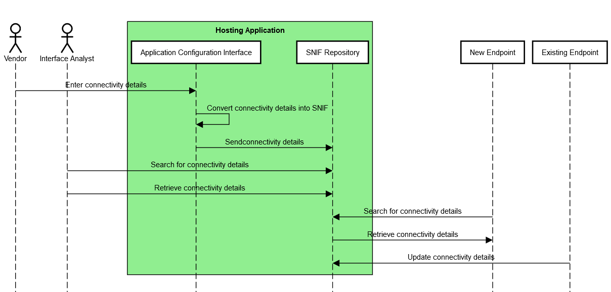
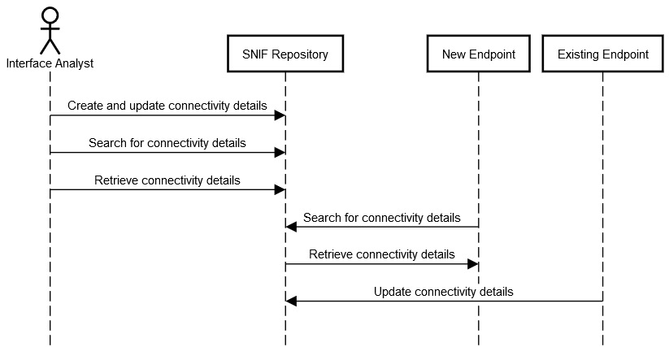
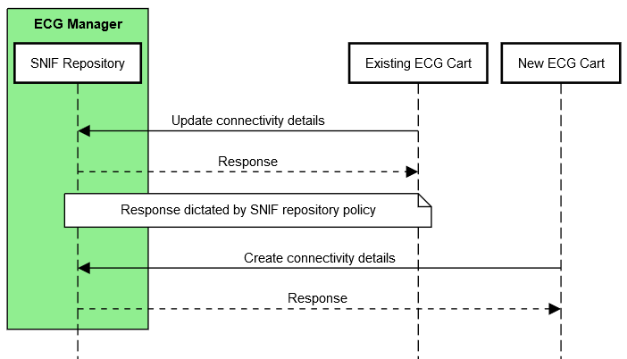
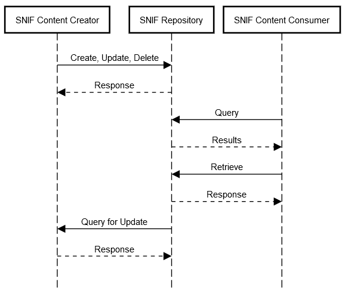
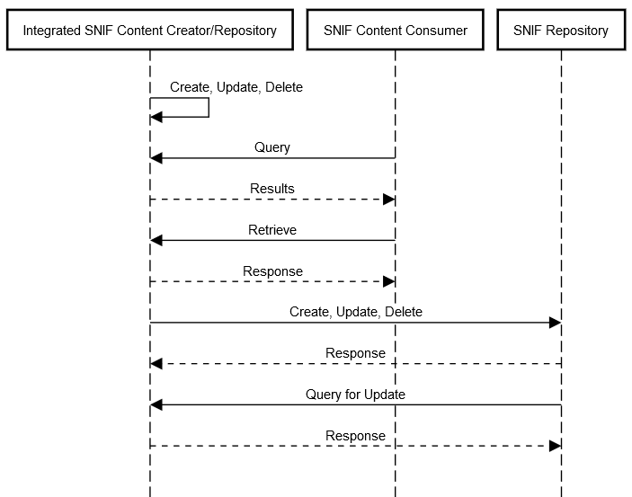

**IHE IT Infrastructure** **White Paper**

**Survey of Network Interfaces Form**

**Contents**
* [Introduction](#introduction)
* [Summary](#summary)
* [Use Cases](#use-cases)
* [Profile Proposal](#profile-proposal)

# Introduction

This IHE IT Infrastructure Survey of Network Interfaces Form (SNIF)
White Paper describes the need for, the value of, and the approach for
establishing a central data source of technical connectivity details for
HL7®\[1\] v2, XD\*, DICOM®\[2\] and
FHIR®\[3\] endpoints to support search and retrieval of
services and endpoints.

## Purpose of the Survey of Network Interfaces Form White Paper

During system implementation within a healthcare institution,
identification of endpoint service connection details requires the
cooperation of the healthcare institution, integrators and vendors. Once
a system is deployed into clinical use, these details are often
difficult to find due to dispersal of the project team, inadequate
record keeping, and configuration changes. The proposal of this white
paper is to start with a standardized form.*

The purpose of this white paper is to present the issues within the
healthcare enterprise relating to the cataloguing, search and retrieval
of endpoint service connection details, describes related use cases and
proposes a minimally viable IHE profile to address desirable situation
use cases [below](#use-cases).

## Scope

This white paper encompasses the cataloguing, search and retrieval of
endpoint connectivity details for standards commonly profiled within
IHE. Although SNIF could be useful in documenting intra-system
interfaces not exposed to the enterprise, (such as failover or load
balancing), and in implementing and managing security controls, these
use cases are out of scope for this white paper.

## Intended Audience

The intended audience of the IHE ITI Survey of Network Interfaces Form
White Paper is:

  - IT departments of healthcare institutions

  - Integrators, consultants and interface analysts

  - Technical staff of vendors participating in the deployment and
    service of healthcare applications

## Open Issues and Questions
See Open and Closed [Issues](/Issues.md)

# Summary

The search for and discovery of system-to-system interface connection
details enabling IHE profiles within the healthcare enterprise can be
burdensome throughout the application lifecycle of installation, upgrade
and repair.

## Problem Description

Interfaces are often manually configured, requiring trained integrators
to gather configuration properties, configure and test interoperability.
The human element introduces the opportunity for errors, often
typographical, that can be difficult to identify and correct. The
increasing adoption of secure connectivity protocols complicates
connectivity by introducing additional connectivity properties, such as
logging, and certificates.

There are no public figures on the specific price for the configuration
of interoperable products, however there is much commentary on the
expense associated with system integration, upgrade and repair. One
paper estimates a savings of seven hours when a configuration management
tool is used to assist in the set up a [new cath
lab](https://www.ijert.org/research/dicom-configuration-management-using-configuration-cockpit-tool-IJERTCONV6IS13190.pdf).

*The participation and role of institutions in the management of
endpoints varies. The level of interface endpoint cataloguing ranges
from not at all to incomplete and informal. Catalogues that are
established may be maintained by the institution, consultants, vendors
or a combination of any of the three.*

*During the implementation of a new system, some institutions can
readily provide endpoint interfaces; most* do not maintain a catalogue,
taking days or weeks to compile a site inventory.

Standards, documentation, and endpoint capabilities are not maintained
by or known to institution IT staff. Endpoint interface details are
often siloed within each systems’ administrative interfaces.

Process barriers include limited institutional resources, restricted
access to vendor-maintained configurations, inconsistent user interfaces
for accessing system configurations, incomplete system inventories
across the institution, and unknown connectivity properties, features
and requirements.

Technical barriers include the lack of a standard set of metadata
defined for healthcare system interfaces, and the lack of an API to
search and retrieve this information for each interface.

## System Configuration Catalogs in Other Work Items 

The challenge of configuration registration and discovery is not unique
to interoperability associated with IHE profiles, a non-exhaustive list
of configuration solutions and standards may be found below, none of
which are widely adopted in healthcare.

### IHE

#### Connectathon Testbed 

During an IHE Connectathon, technical details of hundreds of endpoints
must be catalogued, searched and retrieved in order to perform peer to
peer interoperability connectivity testing. A searchable [configuration
data source](https://gazelle.ihe.net/content/system-configuration) for
web services, DICOM and HL7 v2 within the Gazelle Test Management system
allows test participants to create, update, view and .csv export
endpoint details.

Figure 2.2.1.1-1: Sample IHE Connectathon Configurations in Gazelle Test
Management

#### IHE PCD Domain Configuration Use Cases

The IHE Patient Care Device (PCD) Domain concentrates on profiles
pertaining to patient-centric point-of-care medical devices (such as
vital signs monitors and infusion pumps). IHE PCD has identified use
cases within the recent Service-oriented Device Point-of-care
[Interoperability (SDPi) White
Paper](https://www.ihe.net/uploadedFiles/Documents/PCD/IHE_PCD_WP_SDPi_UseCases_Rev1-1_Pub_2019-11-01.pdf),
in which devices exchange software and hardware configuration details
(*UC.33, UC.194 and UC.199)* to facilitate biomedical equipment
management.

#### IHE ITI Configuration Management White Paper

In 2007, IHE ITI began to draft a [Configuration Management White
Paper](ftp://ftp.ihe.net/IT_Infrastructure/iheitiyr5-2007-2008/Technical_Cmte/Whitepaper_Work/Configuration/Config-Whitepaper-Outline04.doc)
that proposed extending the DICOM LDAP model to HL7 v2 and XD\* web
services. Although this was not published as an IHE White Paper, its
development fed into other work products, and was considered in the
development of this white paper.

### DICOM

One of the earliest attempts to standardize system configuration was
within the Digital Imaging and Communications in Medicine (DICOM)
Standard.

#### Configuration Management Profiles

In 2001, DICOM convened an ad hoc group on configuration management that
developed use cases and a data model that led to the development of
Supplement 67, [Configuration
Management](http://dicom.nema.org/medical/dicom/current/output/html/part15.html#chapter_7),
which was introduced into the DICOM standard in 2004.

Despite leveraging an existing LDAP infrastructure for campus
configuration management support, a review of DICOM conformance
statements reveals that most products do not support DICOM Application
Configuration Management Profiles.

Poor adoption of LDAP for configuration and their engineering-centric
nature are among the factors that have inhibited the acceptance of the
DICOM Configuration Management Profiles in the marketplace.

### Other

Other Configuration Management worth noting include:

  - [Interface definition language
    (IDL)](https://en.wikipedia.org/wiki/Interface_description_language),
    such as Web Services Description Language (WSDL) or Object
    Management group (OMG)

  - Universal Description, [Discovery and Integration (UDDI)
    OASIS](https://www.oasis-open.org/committees/tc_home.php?wg_abbrev=uddi-spec)
    standard that is no longer maintained

  - [WoT (Web of Things) Thing
    Description](https://www.w3.org/TR/2020/PR-wot-thing-description-20200130/),
    a work item from the W3C Working Group, recently open for public
    comment

  - [FHIR
    CapabilityStatement](http://hl7.org/fhir/http.html#capabilities)
    resource and its expected publication on the metadata endpoint of a
    server

  - [FHIR Endpoint resource](https://www.hl7.org/fhir/endpoint.html)
    describes the technical details for how to connect to a FHIR server,
    and for what purposes

  - [mCSD, Mobile Care Services
    Discovery](https://www.ihe.net/uploadedFiles/Documents/ITI/IHE_ITI_Suppl_mCSD.pdf),
    provides a provides a RESTful interface to discover Care Services;
    endpoint services could be managed in a similar manner

  - DICOMweb includes a [WADL Retrieve Capabilities
    Transaction](http://dicom.nema.org/medical/dicom/current/output/chtml/part18/sect_8.9.html),
    a machine-readable description of the service(s) implemented by an
    origin server

  - [IEEE 11073](https://en.wikipedia.org/wiki/ISO/IEEE_11073) contains
    configuration specifications for point of care / personal health
    devices

  - [Configuration Management with
    SNMP](https://datatracker.ietf.org/wg/snmpconf/about/) (Simple
    Network Management Protocol, snmpconf)

  - [Key Management Interoperability Protocol
    (KMIP)](https://www.oasis-open.org/committees/tc_home.php?wg_abbrev=kmip)

  - [Universal Plug and Play
    (UPnP)](https://openconnectivity.org/developer/specifications/upnp-resources/upnp/),
    a set of networking protocols supporting zero-configuration and
    automatic discovery in local area networks

  - [Web Services for Management (WS-Management)
    Specification](https://www.dmtf.org/sites/default/files/standards/documents/DSP0226_1.2.0.pdf),
    a SOAP-based protocol for the management of servers, devices,
    applications and various Web services

  - [DNS Service Discovery (DNS-SD)](http://www.dns-sd.org/)
    standardizes DNS programming interfaces, servers, and packet formats
    to browse the network for services

  - Commercially available or open-source products that provide similar
    services

# Use Cases 

The current state use cases below touch upon the impact of unaccounted
endpoint connectivity details, in which information must be collected
and reconstructed.

The desired state introduces a standard data format and interface as a
basic service to *catalogue and search for* connectivity details. This
offers the potential to reduce the time and effort spent in the
discovery of HL7 v2, XD\*, DICOM and FHIR endpoint details.

## Use Case \#1 - New Single System Implementation

A new system is introduced into an existing enterprise that requires
configuration to interface with other systems and vice-versa.

Implementation of a new system, whether a modality, such as an
Ultrasound system, or an Information Management system, such as a
Cardiovascular IT system requires exchanging technical details of
connectivity to integrate within the existing enterprise.

### Current State: New Single System Install 

An institution interface analyst or system administrator is assigned to
the project (departmental integrator). This may be formal or informal.
Larger projects may also involve a project management resource.

Interface connectivity to existing systems is determined by the
departmental integrator and vendors based on institution policy, use
cases, departmental workflow and feature availability within the new and
peer systems.

Endpoint configuration details are collected from the existing systems
by the departmental integrator, potentially with the assistance of
vendors.

The vendor configures the new system and the institution integrator
coordinates the configuration of existing systems with vendors.

The configured interfaces are tested by the vendor and departmental
integrator.

Any errors identified through testing are corrected by the departmental
integrator and vendors. Errors may be due to incompatibilities, errors
or missing features (i.e., an existing EKG cart is missing a DICOM
license option).

The new system is cut into production and institutional and vendor team
members are re-deployed to other projects. New teams take over
responsibility for service and maintenance.

### Desired State: New Single System Install 

During the planning phase, the institution interface analyst reviews the
new system specifications and compares them to information within a
human readable SNIF retrieved from the repository, discovering that the
new system may be undersized based on the number of existing endpoints
and that some of the existing systems have incompatible interface
versions.

The vendor is provided relevant entries from the institution’s SNIF.
Mismatches are reviewed with the vendor integrator and the
implementation plan is modified to ensure desired connectivity between
the new and existing systems is achieved.

During implementation, relevant SNIF entries are imported into the new
system, avoiding manual entry and typographical errors. The new system
is created in the institution’s SNIF data source and it’s SNIF
parameters are retrieved by the owners of the existing systems,
identified in SNIF, to assist in TLS certificate exchange and
connectivity testing.

## Use Case \#2 - Service

A service disruption between two or more endpoints may be caused by a
network change or disruption, device repair swap-out, proactive service,
software update, software anomaly, or system hang. Troubleshooting and
repair frequently requires knowledge of the technical details associated
with each endpoint interface.

### Current State: Service

An institution interface analyst or system administrator responds to the
service disruption. In evaluating the disruption, the interface
analysist requires endpoint interface details to perform triage. The
interface analyst spends time researching technical details of each
interface in order to assess availability and identify vendors to engage
in addressing the problem. Once engaged, vendor(s) may require
additional interface details, depending on the completeness of the
initial discovery performed by the institution.

Through iterative testing and gathering of information by those
involved, the root cause of the disruption can be determined and
addressed.

In cases where the solution requires an interface change, interface
technical details are often modified, and the new system endpoint
configurations are not catalogued.

### Desired State: Service

In the initial triage of a service disruption, or in planning proactive
service, the institution system administrator searches and retrieves
interface connectivity details for the effected systems registered in
the SNIF repository and immediately focuses activities based on known
security profiles, network addresses, ports and departmental contacts
documented within the SNIF.

In the case of a device repair swap-out, the spare is pre-configured in
the biomed department before the physical swap-out, based on the SNIF,
reducing re-configuration time.

# Profile Proposal

## Description

The objective of a SNIF Profile is to define a standard resource for
institutions to catalog, search and access endpoint configuration
details. SNIF is initially intended as a content profile with a basic
coordinated infrastructure that serves information sharing needs.

In one deployment alternative, the SNIF data source would exist as a
centralized service, such as an opensource, lightweight application. A
second deployment alternative could be to pair the SNIF data source with
a network management system. Each of these deployments establish an
authoritative source of technical connectivity details; each also
implies a dedication of healthcare institutional resources to maintain
the catalogue.

A third deployment alternative could be a vendor assisted resource, in
which products catalog and expose connectivity details in a standardized
manner. In this alternative, products expose their connectivity details,
as well as the connectivity details of registered peers within that
product. This alternative potentially reduces healthcare institutional
resource overhead, eliminates manual entry, and offers a method to
automatically catalogue connectivity details of legacy products. This
alternative; however, potentially introduces multiple SNIF data sources
throughout the ecosystem. Without an authoritative source, healthcare
institutions would be forced to manage duplicate and conflicting
information (e.g., two Creators attempt to create or update information
for the same endpoint entry).

Figure 4.1-1: Vendor Assisted Model

Figure 4.1-1 depicts a fictional “DICOM SCP Server” that translates and
exposes the connectivity details of itself and its registered peers into
a standardized SNIF format (screen capture courtesy of DVTk QR SCP
Emulator 5.0.1).

## Process Flow

In this scenario an application exposes existing, endpoint configuration
details in a SNIF that is accessible to the institution in a
standardized manner.

At installation, the vendor enters endpoint configuration details in the
application’s user interface. Configuration details are translated into
a common SNIF format. From there, they could be made available for
search and retrieval in an onboard SNIF repository and/or transmitted to
centralized SNIF repository.

Actors retrieve SNIF connectivity details.

Figure 4.2-1: SNIF Process Flow, Vendor-Assisted

Figure 4.2-2: SNIF Process Flow, Centralized Repository

## Security Controls

The SNIF will require a proper security model based on local security
policy, considerations and threat model. It is expected that a range of
security models are possible. Although the SNIF is not intended to
include a specific security model, it is expected that SNIF will group
actors with actors from the IHE Audit Trail and Node Authentication and
will need a capability of access control and secure communications.

Other IHE Integration Profiles complementary to SNIF are available
(e.g., Enterprise User Authentication, Document Digital Signature,
etc.).

ATNA expects that local governance determines which methods of user
authentication will be used, however token, federated or Kerberos-based
authentication methods, as in IUA, XUA or EUA could be also employed.

A SNIF creator may digitally sign a SNIF, supporting the Digital
Signature (DSG) Content Profile as a Document Source. When a SNIF
consumer needs to verify a Digital Signature, it may retrieve the
digital signature document and may perform the verification against the
signed document content.

## Actors 

### SNIF Content Creator

The Content Creator is responsible for populating, deleting and updating
endpoint configuration details within the SNIF that will be shared or
exchanged between other IHE actors.

A stand-alone SNIF Content Creator could be network planning software,
utilized in the planning of an implementation (as in 3.1 above) that
creates planned SNIF content within the SNIF Repository. In a more
likely scenario, the SNIF Content Creator would be grouped with other
actors, such as a Modality, Audit Consumer, or Document Repository, in
which the actor creates or updates its own configuration details within
the SNIF Repository.

### SNIF Repository

The Repository is responsible for the persistent storage of the SNIF. In
addition, the Repository could query existing SNIF Content Creators for
updates based on a polling interval defined by local policy.

As with the SNIF Content Creator, an opensource or network management
system could act as a stand-alone SNIF Repository. Other scenarios could
imagine the SNIF Repository grouped with an Image Manager/Archive or an
Initiating/Responding Gateway.

### Integrated SNIF Content Creator/Repository

The Integrated SNIF Content Creator/Repository combines the
functionality of the Content Creator and Repository actors into a single
actor that exposes peer endpoint configuration details configured on
that server.

For example, an ECG Manager could act as a SNIF Content Creator by
translating ECG cart endpoint connectivity details into SNIF and
exposing these to Content Consumers as a Repository.

For viability, data management policies are required to deal with
duplicate or conflicting SNIF content from external Content Creators.
For example, a repository could choose to refuse Create/Update
transactions, merge Create/Update transactions with existing SNIF
entries, present duplicate SNIF entries in query responses, or flag
conflicts for user resolution.

In addition to Security Controls, Digital Signatures provide a
clear source and timestamp that aids in establishing an authoritative
SNIF source.

Figure 4.4.3-1: Application of a Data Management Policy

### SNIF Content Consumer

The Consumer is responsible for queries based on connectivity details,
and retrieval of SNIF meeting query criteria. Queries would be based on
data elements described in the SNIF Contents Data Model.

For example, a Protocol Manager could be grouped with SNIF Content
Consumer in order to retrieve connectivity details for Modality actors
supporting DICOM protocol object transfer.

### Grouping

It is envisioned that Security Controls warrants grouping
as below. An actor from this profile (Column 1) shall implement all the
required transactions and/or content modules in this profile in addition
to all transactions required for the grouped actor (Column 2).

Table 4.4.5-1: SNIF Required Actor Groupings

| SNIF Actor       | Profile/Actor to be grouped with         |
| ---------------- | ---------------------------------------- |
| Content Creator  | ATNA / Secure Node or Secure Application |
|                  | CT / Time Client                         |
| Repository       | ATNA / Secure Node or Secure Application |
|                  | CT / Time Client                         |
| Content Consumer | ATNA / Secure Node or Secure Application |
|                  | CT / Time Client                         |

## Transactions

Transactions support the basic population of the creation and management
of the SNIF.

Figure 4.5-1: SNIF Transactions for individual Content Creator,
Repository and Consumer actors

Figure 4.5-2: SNIF Transactions for Integrated Content
Creator/Repository and Consumer actors

Figure 4.5-3: SNIF Transactions for Integrated Content
Creator/Repository and Consumer actors with a Central Repository

## Data Model

### SNIF Repository Data Model

A SNIF Repository requires a data model in order to be distinguished
from and registered within other SNIF Repositories.

Table 4.6.1-1: Elements in the SNIF Data Model

| Element               | Description                                                  |
| --------------------- | ------------------------------------------------------------ |
| Identifier            | Unique identifier of the SNIF Repository used across systems |
| Name                  | Identifiable name of the SNIF Repository                     |
| Managing Organization | Organization that manages this SNIF Repository               |
| Contact               | Contact (owner) details for this SNIF Repository             |
| Period                | Interval this SNIF Repository is expected to be operational  |
| Last Update           | Last update of this SNIF Repository                          |
| Status                | Planned, Test, Production                                    |

### SNIF Contents Data Model

Each standard utilized in IHE profiles offer unique levels of
complexity. For a profile to be simple, yet robust, a common data model
should be established.

The table below is non-comprehensive and intended as a starting point
for the SNIF Profile. The four columns to the right (FHIR, HL7 v2,
DICOM, XD\*) contain the relationship of each element to that standard,
each described as required (“\*”), strongly recommended (“x”),
recommended (“o”) or not applicable (empty). Data elements within the
model are grouped by Administrative, Operational and Technical, posing
an opportunity to profile existing standards as appropriate by group.

This initial data model does not address cardinality, although it is
recognized that one address may offer multiple services (e.g., DICOM
Modality Worklist, Performed Procedure Step, Storage and Storage
Commit).

Finally, it is also recognized that some of elements below are better
represented through encoding for machine readability.

Table 4.6.2-1: SNIF Data Model Elements - categorized

| Element                                    | Description                                                                                                                                                                                                                                                                                                                         | FHIR | HL7 v2 | DICOM | XD\* |
| ------------------------------------------ | ----------------------------------------------------------------------------------------------------------------------------------------------------------------------------------------------------------------------------------------------------------------------------------------------------------------------------------- | ---- | ------ | ----- | ---- |
| Administrative                             |                                                                                                                                                                                                                                                                                                                                     |      |        |       |      |
| Identifier                                 | Unique identifier, used across systems                                                                                                                                                                                                                                                                                              | \*   | \*     | \*    | \*   |
| Name                                       | Identifiable name of the endpoint                                                                                                                                                                                                                                                                                                   | \*   | \*     | \*    | \*   |
| Managing organization                      | Organization that manages this endpoint                                                                                                                                                                                                                                                                                             | \*   | o      |       | \*   |
| Contact                                    | Contact (owner) details                                                                                                                                                                                                                                                                                                             | \*   | \*     | \*    | \*   |
| Operational                                |                                                                                                                                                                                                                                                                                                                                     |      |        |       |      |
| Period                                     | A time period (defined by a start and end date/time) that the endpoint is expected to be operational                                                                                                                                                                                                                                | o    | o      | o     | o    |
| Time zone                                  | Time zone of the endpoint                                                                                                                                                                                                                                                                                                           | o    | o      | o     | o    |
| IHE Profiles & Actors                      | Profile/actor pair(s)                                                                                                                                                                                                                                                                                                               | \*   | \*     | \*    | \*   |
| IHE Transaction & Roles                    | Supported transactions and roles                                                                                                                                                                                                                                                                                                    | o    | o      | o     | o    |
| Status                                     | planned, test, production                                                                                                                                                                                                                                                                                                           | o    | o      | o     | o    |
| Receiving/Sending Facility                 | HL7                                                                                                                                                                                                                                                                                                                                 |      | x      |       |      |
| Receiving/Sending Application              | HL7                                                                                                                                                                                                                                                                                                                                 |      | x      |       |      |
| Integration Guide                          | Site/product specific documentation, such as Implementation Guide, HL7 or DICOM conformance statement, IHE integration statement                                                                                                                                                                                                    | o    | o      | o     | o    |
| Technical                                  |                                                                                                                                                                                                                                                                                                                                     |      |        |       |      |
| Connection type                            | Endpoint protocol or standard                                                                                                                                                                                                                                                                                                       | \*   | \*     | \*    | \*   |
| Connection type version                    | Endpoint protocol or standard version                                                                                                                                                                                                                                                                                               | x    | x      |       |      |
| Transport                                  | TCP/IP, HTTP, MLLP                                                                                                                                                                                                                                                                                                                  |      | \*     | \*    |      |
| Service details                            | [DICOM PS3.15 Annex H](ttp://dicom.nema.org/medical/dicom/current/output/html/part15.html#chapter_H), [DICOMweb Capabilities](http://dicom.nema.org/medical/dicom/current/output/html/part18.html#sect_8.9), [FHIR Capability Statement](https://www.hl7.org/fhir/capabilitystatement.html), HL7 messages supported, DIMSE services | o    | \*     | \*    | o    |
| Address                                    | Address for connecting to this endpoint (e.g., URL, IP/hostname, port)                                                                                                                                                                                                                                                              | \*   | \*     | \*    | \*   |
| Connection type security description       | [IHE ATNA Options](https://gazelle.ihe.net/files/CP-ITI-1151-04-ballot54.pdf) *(CP-ITI-1151)*                                                                                                                                                                                                                                       | \*   | \*     | \*    | \*   |
| Connection security certificate management | Signed Direct Comparison, Certificate Authority                                                                                                                                                                                                                                                                                     | \*   | \*     | \*    | \*   |
| Transmission                               | Synchronous or asynchronous communication                                                                                                                                                                                                                                                                                           | o    | o      | o     | o    |
| Application Entity                         | DICOM AE title                                                                                                                                                                                                                                                                                                                      |      |        | \*    |      |

## Future Profile Extensions

This white paper scopes the minimum viable profile for cataloguing,
search and retrieval of endpoint connectivity details for standards
commonly profiled within IHE.

Once adopted, it is envisioned that future revisions to the SNIF Profile
would include transactions to establish a plug-and-play environment in
which discovery and registration establish systems’ configuration
without human intervention.

For example, a system newly introduced to a network performs an
auto-discovery to identify the SNIF repository, self-registers and
automatically retrieves and configures *appropriate connections based on
purpose and capabilities.*

1.  HL7 is the registered trademark of Health Level Seven International
    and the use does not constitute endorsement by HL7.

2.  DICOM is the registered trademark of the National Electrical
    Manufacturers Association for its standards publications relating to
    digital communications of medical information.

3.  FHIR is the registered trademark of Health Level Seven International
    and the use does not constitute endorsement by HL7.
